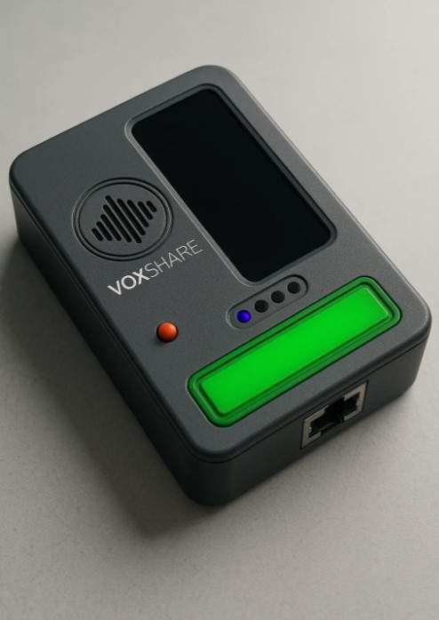

# VoxShare device

**VoxShare device** is a implementation push-to-talk multicast voice chat application in hardware.

---

## 🎧 Features

- Voice transmission via UDP multicast
- Using the OPUS codec to optimize network bandwidth
- Push-to-talk button with visual feedback
- Peers list (including peer activity) OLED screen
- Lightweight and easy to use
- POE support

## 🔧 How it works

1. **Audio Input**: VoxShare captures audio from the selected microphone in real-time.
2. **Push-to-Talk**: Audio is transmitted only while the push-to-talk button (space) is held down.
3. **Multicast UDP**: Audio packets are sent over a multicast UDP channel to all clients in the local network.
4. **Client Discovery**: Clients periodically broadcast small `PING` packets to detect active peers.

## 📷 Screenshot

## ▶️ Usage

1. Connect device to POE network switch 
2. Press and hold green button to talk.
3. Speak and release when done.

---

Made with ❤️ by [EugenyH](https://github.com/eugenyh)

